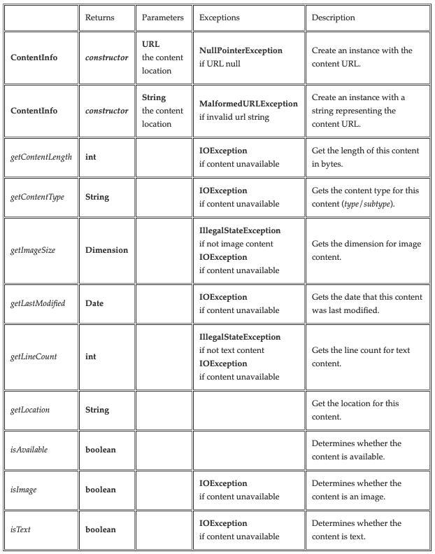

# url-content-class

## Initial Assignment

The purpose of this assignment is to make sure that your Java development environment is set up and you are able to check out and check in code to a GitHub repository. For this exercise, you will need the ability to create JUnit test functions, and the capability to generate JavaDoc from your Java classes.

Create a class ContentInfo in the default package that provides information about content specified by a URL. Also create a class ContentInfoTest that implements JUnit tests for the ContentInfo class. Be sure to provide complete JavaDoc documentation for both classes, and include any helpful documentation within methods that aid in understanding their implemetation.

## ContentInfo

This public class provides information about content specified by a URL by implementing these public constructors and methods.

**Notes**

* IllegalStateException and NullPointerException are unchecked and so do not need to be declared, but they must be documented.
* See java.net.URL for information about functionality for accessing content information.
* See java.util.Date for information about creating dates from long time values.
* See javax.imageio.ImageIO for information about getting image width and height from an image input stream.

**Special note on getting a URL connection**

Create a private getConnection() method that returns a URLConnection for the instance URL, or throws a IOException if the content is not available, Use this method to implement the public methods.

If the type of URLConnection returned by URL.connect() is HttpURLConnection, special handling is required for HTTP/HTTPS protocols. For other protocols, the URLConnection can be returned.

For a HttpURLConnection, getting the connection does not guarantee that the content exists. Instead, the HttpURLConnection.setRequestMethod() should be called with "GET", and then the connection response code requested. The HTTP server responds with HttpURLConnection.HTTP_OK if the content is available. Otherwise the getConnection() method throws a IOException.

An optimization is to add a boolean parameter to getConnection(). If true, use the request method "GET" because the content is required, or "HEAD" if false because the method is only being used to test for the existence of the content. This saves fetching the content if it is not required.

### JavaDoc

Generate standard JavaDoc for all public, package, protected, and private members and methods of both classes and for the classes themselves into a "docs" subdirectory. Make sure that JavaDoc does not report any errors such as undocumented parameters or undocumented exceptions thrown. Inspect your JavaDoc in a web browser starting with the generated "index.html" to make sure it is complete.